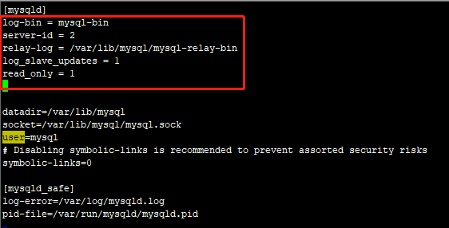
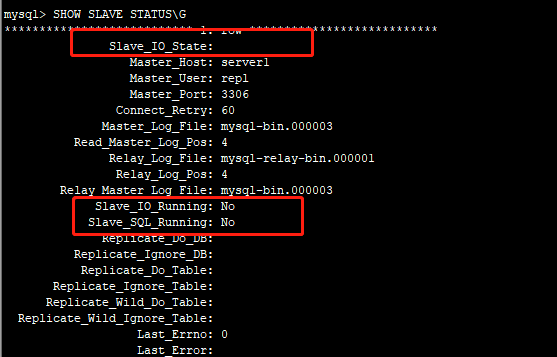
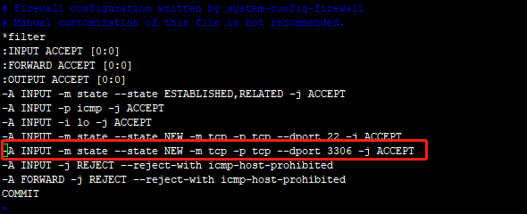

### 配置环境

虚拟机上搭建两台服务器，配置如下:

|配置项|主数据库|从数据库|
|:-----:|:------:|:------:|
|Linux系统| CentOS 6.5| CentOS 6.5|
|MySQL版本| 5.1.73| 5.1.73|
|IP地址| 192.168.0.66 |192.168.0.120|


### 配置复制

#### 配置步骤：

1. 每台服务上创建复制账号;
2. 配置主库和备库;
3. 通知备库连接到主库并从主库复制数据;


#### 配置过程：

##### 第1步：创建复制账号

在主库(192.168.0.66和从库(192.168.0.120)上，进行同步账号创建跟授权，如下:
*	创建同步用户账号跟密码， 用户账号: repl , 密码: password；
*	给repl用户授权复制限制，并且限制只能在192.169.0. 网络网段上。
```
mysql> CREATE USER 'repl'@'192.168.0.%' IDENTIFIED BY 'password';
mysql> GRANT REPLICATION SLAVE, REPLICATION CLIENT ON *.* TO 'repl'@'192.168.0.%';
```
说明

* 复制账户其实只需要有主库上的**REPLICATION SLAVE**权限, 并不一定需要都有**REPLICATION CLIENT**权限
*  **REPLICATION CLIENT** 主要有2方面作用:
		(1). 监控和管理复制的账号
		(2). 方法交换主从库的角色
		


##### 第2步：配置主库跟备库配置文件

**配置主库**

编辑  MySQL配置文件  $/etc/my.cnf$ 

```
$ vim /etc/my.cnf
```
添加或修改以下2项:
```
[mysqld]
log-bin = mysql-bin
server-id = 10
```

注意:
*	log-bin 跟 server-id 一定要在 **[mysqld]** 下配置，否则其他地方可能不会生效；
* server_id 一般使用服务器IP地址末尾8位，但要保证它不变且唯一的


**如果之前没在MySQL配置文件中指定log-bin选项，那就得重启MySQL**
```
service mysqld restart
```


检查主库是否配置成功

```
mysql> show master status;
```


**配置从库**

同样在$/etc/my.cnf$ 文件上的**[mysqld]**添加或修改以下2项:
```
[mysqld]
log-bin = mysql-bin
server-id = 2
relay-log = /var/lib/mysql/mysql-relay-bin
log_slave_updates = 1
read_only = 1
```
说明

* relay-log = /var/lib/mysql/mysql-relay-bin ： 指定中继日志的位置和命名
* log_slave_updates = 1 ：允许备库将其重放的事件也记录到自身的二进制日志中
* read_only :会阻止任何没有特权权限的线程修改数据




重启数据库，同样检查是否配置成功


```
mysql> show master status;
```


此时，到这里，主从库配置文件**/etc/my.cnf**就配置成功了，接下来第三步启动复制。

##### 第三步：启动复制

在从库上执行复制语句 CHAGE MASTER TO 

```
mysql> CHANGE MASTER TO MASTER_HOST='server1', 
	-> MASTER_USER='repl', 
	-> MASTER_PASSWORD='password', 
	-> MASTER_LOG_POS=0;
	-> MASTER_LOG_FILE='mysql-bin.000003', 
```
说明

* MASTER_LOG_POS：设置从日志的开头读取
* MASTER_LOG_FILE：复制的主库二进制文件名mysql-bin.000003

检查复制是否正确执行

```
mysql> SHOW SLAVE STATUS\G;
```

```
mysql> SHOW SLAVE STATUS\G
*************************** 1. row ***************************
               Slave_IO_State: 
                  Master_Host: server1
                  Master_User: repl
                  Master_Port: 3306
                Connect_Retry: 60
              Master_Log_File: mysql-bin.000003
          Read_Master_Log_Pos: 4
               Relay_Log_File: mysql-relay-bin.000001
                Relay_Log_Pos: 4
        Relay_Master_Log_File: mysql-bin.000003
             Slave_IO_Running: No
            Slave_SQL_Running: No
              Replicate_Do_DB: 
          Replicate_Ignore_DB: 
           Replicate_Do_Table: 
       Replicate_Ignore_Table: 
      Replicate_Wild_Do_Table: 
  Replicate_Wild_Ignore_Table: 
                   Last_Errno: 0
                   Last_Error: 
                 Skip_Counter: 0
          Exec_Master_Log_Pos: 4
              Relay_Log_Space: 106
              Until_Condition: None
               Until_Log_File: 
                Until_Log_Pos: 0
           Master_SSL_Allowed: No
           Master_SSL_CA_File: 
           Master_SSL_CA_Path: 
              Master_SSL_Cert: 
            Master_SSL_Cipher: 
               Master_SSL_Key: 
        Seconds_Behind_Master: NULL
Master_SSL_Verify_Server_Cert: No
                Last_IO_Errno: 0
                Last_IO_Error: 
               Last_SQL_Errno: 0
               Last_SQL_Error: 
1 row in set (0.00 sec)
```




Slave_IO_State、Slave_IO_Running、Slave_SQL_Running 这三项显示当前从库复制尚未运行。

启动开始复制
```
mysql> START SLAVE
```

```
mysql> START SLAVE;
Query OK, 0 rows affected (0.00 sec)

```

检查执行是否有错误
```
mysql> SHOW SLAVE STATUS\G
```

显示错误代码**Last_IO_Errno: 2005**：
> Slave_IO_Running: No
> Last_IO_Errno: 2005
> Slave_SQL_Running: Yes          
> Last_IO_Error: error connecting to master 'repl@server1:3306' - retry-time: 60  retries: 86400

```
mysql> SHOW SLAVE STATUS\G
*************************** 1. row ***************************
               Slave_IO_State: Connecting to master
                  Master_Host: server1
                  Master_User: repl
                  Master_Port: 3306
                Connect_Retry: 60
              Master_Log_File: mysql-bin.000003
          Read_Master_Log_Pos: 4
               Relay_Log_File: mysql-relay-bin.000001
                Relay_Log_Pos: 4
        Relay_Master_Log_File: mysql-bin.000003
             Slave_IO_Running: No
            Slave_SQL_Running: Yes
              Replicate_Do_DB: 
          Replicate_Ignore_DB: 
           Replicate_Do_Table: 
       Replicate_Ignore_Table: 
      Replicate_Wild_Do_Table: 
  Replicate_Wild_Ignore_Table: 
                   Last_Errno: 0
                   Last_Error: 
                 Skip_Counter: 0
          Exec_Master_Log_Pos: 4
              Relay_Log_Space: 106
              Until_Condition: None
               Until_Log_File: 
                Until_Log_Pos: 0
           Master_SSL_Allowed: No
           Master_SSL_CA_File: 
           Master_SSL_CA_Path: 
              Master_SSL_Cert: 
            Master_SSL_Cipher: 
               Master_SSL_Key: 
        Seconds_Behind_Master: NULL
Master_SSL_Verify_Server_Cert: No
                Last_IO_Errno: 2005
                Last_IO_Error: error connecting to master 'repl@server1:3306' - retry-time: 60  retries: 86400
               Last_SQL_Errno: 0
               Last_SQL_Error: 
1 row in set (0.00 sec)
```

检查推断
发现配置复制语句时候**MASTER_HOST**选项错误，应该修改为**主服务器IP地址192.168.0.66** 

先暂停复制操作
```
mysql> STOP SLAVE;
```
重新配置复制命令语句
```
mysql> CHANGE MASTER TO MASTER_HOST='192.168.0.66', 
	-> MASTER_USER='repl', 
	-> MASTER_PASSWORD='password', 
	-> MASTER_LOG_POS=0;
	-> MASTER_LOG_FILE='mysql-bin.000003',
```

再次查看执行复制，然后查找复制执行是否正确

显示错误代码**Last_IO_Errno: 2013**：
> Slave_IO_Running: No
> Last_IO_Errno: 2013
> Last_IO_Error: error connecting to master 'repl@192.168.0.66:3306' - retry-time: 60  retries: 86400


```
mysql> SHOW SLAVE STATUS\G
*************************** 1. row ***************************
               Slave_IO_State: Connecting to master
                  Master_Host: 192.168.0.66
                  Master_User: repl
                  Master_Port: 3306
                Connect_Retry: 60
              Master_Log_File: mysql-bin.000003
          Read_Master_Log_Pos: 4
               Relay_Log_File: mysql-relay-bin.000002
                Relay_Log_Pos: 4
        Relay_Master_Log_File: mysql-bin.000003
             Slave_IO_Running: No
            Slave_SQL_Running: Yes
              Replicate_Do_DB: 
          Replicate_Ignore_DB: 
           Replicate_Do_Table: 
       Replicate_Ignore_Table: 
      Replicate_Wild_Do_Table: 
  Replicate_Wild_Ignore_Table: 
                   Last_Errno: 0
                   Last_Error: 
                 Skip_Counter: 0
          Exec_Master_Log_Pos: 4
              Relay_Log_Space: 106
              Until_Condition: None
               Until_Log_File: 
                Until_Log_Pos: 0
           Master_SSL_Allowed: No
           Master_SSL_CA_File: 
           Master_SSL_CA_Path: 
              Master_SSL_Cert: 
            Master_SSL_Cipher: 
               Master_SSL_Key: 
        Seconds_Behind_Master: NULL
Master_SSL_Verify_Server_Cert: No
                Last_IO_Errno: 2013
                Last_IO_Error: error connecting to master 'repl@192.168.0.66:3306' - retry-time: 60  retries: 86400
               Last_SQL_Errno: 0
               Last_SQL_Error: 
1 row in set (0.00 sec)
```
同时查看错误日志


后来网上找了很久，发现防火墙可能得加mysql端口3306才行,所以**两台服务器**最好都进行配置

防火墙开启3306端口
 
 * 编辑 **/etc/sysconfig/iptables** 文件

```
 vim /etc/sysconfig/iptables
```

 * 发现真的没有添加3306端口进去，所以要起添加以下配置：

```
-A INPUT -m state --state NEW -m tcp -p tcp --dport 3306 -j ACCEPT
```



 * 重启防火墙
```
# service iptables restart;
```


---------------

#### 模拟数据检验主从复制是否成功


##### 先到主库添加模拟数据

```
mysql> use test;
Reading table information for completion of table and column names
You can turn off this feature to get a quicker startup with -A

Database changed

mysql> CREATE TABLE test_tb1 ( id int(11) primary key, name varchar(255) not null, sex tinyint(1) default 1 comment "1:男；0：女", age int(2) default 1 ) engine=innodb,charset=utf8;

mysql> insert into  test_tb1  (`id`,`name`,`sex`,`age`) values (1, 'user1' , 1, 20);
mysql> insert into  test_tb1  (`id`,`name`,`sex`,`age`) values (2, 'user2' , 0, 18);


mysql> show tables;
+----------------+
| Tables_in_test |
+----------------+
| test_tb1       |
+----------------+
1 row in set (0.00 sec)

mysql> select * from test_tb1;
+----+-------+------+------+
| id | name  | sex  | age  |
+----+-------+------+------+
|  1 | user1 |    1 |   20 |
|  2 | user2 |    0 |   18 |
+----+-------+------+------+
2 rows in set (0.00 sec)
```
##### 从库查看复制状态

```
mysql> SHOW SLAVE STATUS\G
*************************** 1. row ***************************
               Slave_IO_State: 
                  Master_Host: 192.168.0.66
                  Master_User: repl
                  Master_Port: 3306
                Connect_Retry: 60
              Master_Log_File: mysql-bin.000004
          Read_Master_Log_Pos: 106
               Relay_Log_File: mysql-relay-bin.000003
                Relay_Log_Pos: 251
        Relay_Master_Log_File: mysql-bin.000003
             Slave_IO_Running: No
            Slave_SQL_Running: No
              Replicate_Do_DB: 
          Replicate_Ignore_DB: 
           Replicate_Do_Table: 
       Replicate_Ignore_Table: 
      Replicate_Wild_Do_Table: 
  Replicate_Wild_Ignore_Table: 
                   Last_Errno: 1049
                   Last_Error: Error 'Unknown database 'test'' on query. Default database: 'test'. Query: 'CREATE TABLE test_tb1 ( id int(11) primary key, name varchar(255) not null, sex tinyint(1) default 1 comment "1:男；0：女", age int(2) default 1 ) engine=innodb,charset=utf8'
                 Skip_Counter: 0
          Exec_Master_Log_Pos: 106
              Relay_Log_Space: 1414
              Until_Condition: None
               Until_Log_File: 
                Until_Log_Pos: 0
           Master_SSL_Allowed: No
           Master_SSL_CA_File: 
           Master_SSL_CA_Path: 
              Master_SSL_Cert: 
            Master_SSL_Cipher: 
               Master_SSL_Key: 
        Seconds_Behind_Master: NULL
Master_SSL_Verify_Server_Cert: No
                Last_IO_Errno: 0
                Last_IO_Error: 
               Last_SQL_Errno: 1049
               Last_SQL_Error: Error 'Unknown database 'test'' on query. Default database: 'test'. Query: 'CREATE TABLE test_tb1 ( id int(11) primary key, name varchar(255) not null, sex tinyint(1) default 1 comment "1:男；0：女", age int(2) default 1 ) engine=innodb,charset=utf8'
1 row in set (0.00 sec)
```

显示错误**Last_SQL_Errno: 1049**
> Last_SQL_Errno: 1049
> Last_SQL_Error: Error 'Unknown database 'test'' on query. Default database: 'test'. Query: 'CREATE TABLE test_tb1 ( id int(11) primary key, name varchar(255) not null, sex tinyint(1) default 1 comment "1:男；0：女", age int(2) default 1 ) engine=innodb,charset=utf8'

查看了下从库缺少test数据库的导致
```
mysql> show databases;
+--------------------+
| Database           |
+--------------------+
| information_schema |
| mysql              |
+--------------------+
2 rows in set (0.00 sec)

mysql> create database test;
Query OK, 1 row affected (0.01 sec)

mysql> show databases;
+--------------------+
| Database           |
+--------------------+
| information_schema |
| mysql              |
| test               |
+--------------------+
3 rows in set (0.00 sec)

```

再次启动复制语句**START SLAVE**;
```
mysql> START SLAVE;
Query OK, 0 rows affected (0.00 sec)

```

结果复制成功
> Slave_IO_State: Waiting for master to send event   
> Slave_IO_Running: Yes   
> Slave_SQL_Running: Yes   

```

mysql> SHOW SLAVE STATUS\G
*************************** 1. row ***************************
               Slave_IO_State: Waiting for master to send event
                  Master_Host: 192.168.0.66
                  Master_User: repl
                  Master_Port: 3306
                Connect_Retry: 60
              Master_Log_File: mysql-bin.000004
          Read_Master_Log_Pos: 106
               Relay_Log_File: mysql-relay-bin.000005
                Relay_Log_Pos: 251
        Relay_Master_Log_File: mysql-bin.000004
             Slave_IO_Running: Yes
            Slave_SQL_Running: Yes
              Replicate_Do_DB: 
          Replicate_Ignore_DB: 
           Replicate_Do_Table: 
       Replicate_Ignore_Table: 
      Replicate_Wild_Do_Table: 
  Replicate_Wild_Ignore_Table: 
                   Last_Errno: 0
                   Last_Error: 
                 Skip_Counter: 0
          Exec_Master_Log_Pos: 106
              Relay_Log_Space: 551
              Until_Condition: None
               Until_Log_File: 
                Until_Log_Pos: 0
           Master_SSL_Allowed: No
           Master_SSL_CA_File: 
           Master_SSL_CA_Path: 
              Master_SSL_Cert: 
            Master_SSL_Cipher: 
               Master_SSL_Key: 
        Seconds_Behind_Master: 0
Master_SSL_Verify_Server_Cert: No
                Last_IO_Errno: 0
                Last_IO_Error: 
               Last_SQL_Errno: 0
               Last_SQL_Error: 
1 row in set (0.00 sec)
```
进入从库test数据库查看是否后数据

```
mysql> use test;
Reading table information for completion of table and column names
You can turn off this feature to get a quicker startup with -A

Database changed
mysql> show tables;
+----------------+
| Tables_in_test |
+----------------+
| test_tb1       |
+----------------+
1 row in set (0.00 sec)

mysql> select * from test_tb1;
+----+-------+------+------+
| id | name  | sex  | age  |
+----+-------+------+------+
|  1 | user1 |    1 |   20 |
|  2 | user2 |    0 |   18 |
+----+-------+------+------+
2 rows in set (0.00 sec)

```

至此，MySQL主从配置成功实现了。